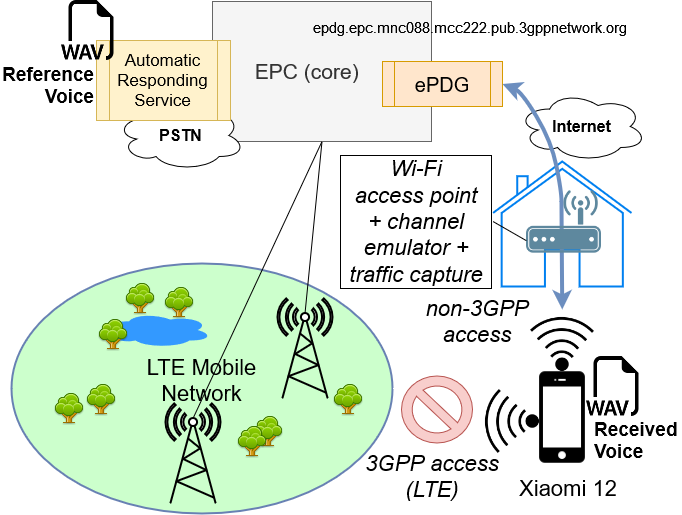
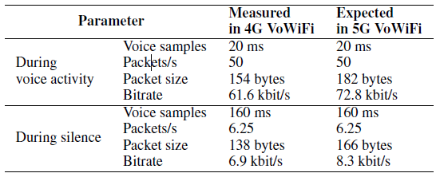

# VoWiFi2024
Reference audio samples for paper: Access Network requirements for 3GPP Voice over Wi-Fi (VoWiFi) service.

We have implemented a testbed using real HW and targeting to Wi-Fi Calling services of a real MNO, as in figure.

The reference voice sample file used at the sender side is reference.wav

In the folders, we have included the received voice sample with post-processing of PESQ (full-reference). The different testing conditions are as below:

| Test case  | Ranging parameter         | Values       |
|------------|---------------------------|--------------|
| Reference  | VoLTE and 3G call         | n.a.         |
| Delay      | one-way delay (no jitter) | 0-500 ms     |
| Jitter     | Per packet jitter         | 0-140 ms     |
| Bottleneck | Per call rate cap         | 54-80 Kbit/s |

The Delay test cases are not includes as delay only is not affecting PESQ evaluation. Full analysis of the quality results under the different configurations is available on [link] - PAPER UNDER REVIEW -

Furthermore, we have included real traffic captures to confirm the traffic model obtained by analysis (including silence periods). 
The main outcomes  of such analysis are reported in the table below.

